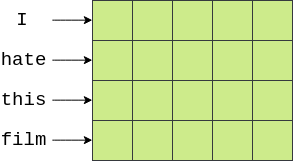
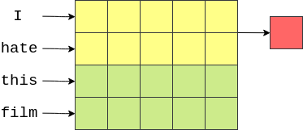
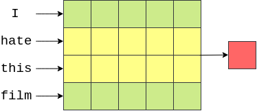
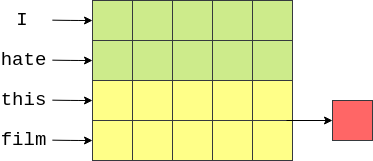
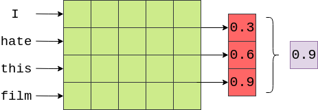

# task4：卷积情感分析 

在本节中，我们将利用卷积神经网络（CNN）进行情感分析，实现 [Convolutional Neural Networks for Sentence Classification](https://arxiv.org/abs/1408.5882)中的模型。

**注**：本次组队学习的目的不会全面介绍和解释CNN。要想学习更对相关知识可以请查看[此处](https://ujjwalkarn.me/2016/08/11/intuitive-explanation-convnets/)和[这里](https://cs231n.github.io/convolutional-networks/)。

卷积神经网络在计算机视觉问题上表现出色，原因在于其能够从局部输入图像块中提取特征，并能将表示模块化，同时可以高效地利用数据。同样的，卷积神经网络也可以用于处理序列数据，时间可以被看作一个空间维度，就像二维图像的高度和宽度。

那么为什么要在文本上使用卷积神经网络呢？与3x3 filter可以查看图像块的方式相同，1x2 filter 可以查看一段文本中的两个连续单词，即双字符。在上一个教程中，我们研究了FastText模型，该模型通过将bi-gram显式添加到文本末尾来使用bi-gram，在这个CNN模型中，我们将使用多个不同大小的filter，这些filter将查看文本中的bi-grams（a 1x2 filter）、tri-grams（a 1x3 filter）and/or n-grams（a 1x$n$ filter）。

## 4.1 数据预处理

与 task3 使用FastText模型的方法不同，本节不再需要刻意地创建bi-gram将它们附加到句子末尾。


```python
import torch
from torchtext.legacy import data
from torchtext.legacy import datasets
import random
import numpy as np

SEED = 1234

random.seed(SEED)
np.random.seed(SEED)
torch.manual_seed(SEED)
torch.backends.cudnn.deterministic = True

TEXT = data.Field(tokenize = 'spacy', 
                  tokenizer_language = 'en_core_web_sm',
                  batch_first = True)
LABEL = data.LabelField(dtype = torch.float)

train_data, test_data = datasets.IMDB.splits(TEXT, LABEL)

train_data, valid_data = train_data.split(random_state = random.seed(SEED))
```

    /home/ben/miniconda3/envs/pytorch17/lib/python3.8/site-packages/torchtext-0.9.0a0+c38fd42-py3.8-linux-x86_64.egg/torchtext/data/field.py:150: UserWarning: Field class will be retired soon and moved to torchtext.legacy. Please see the most recent release notes for further information.
      warnings.warn('{} class will be retired soon and moved to torchtext.legacy. Please see the most recent release notes for further information.'.format(self.__class__.__name__), UserWarning)
    /home/ben/miniconda3/envs/pytorch17/lib/python3.8/site-packages/torchtext-0.9.0a0+c38fd42-py3.8-linux-x86_64.egg/torchtext/data/field.py:150: UserWarning: LabelField class will be retired soon and moved to torchtext.legacy. Please see the most recent release notes for further information.
      warnings.warn('{} class will be retired soon and moved to torchtext.legacy. Please see the most recent release notes for further information.'.format(self.__class__.__name__), UserWarning)
    /home/ben/miniconda3/envs/pytorch17/lib/python3.8/site-packages/torchtext-0.9.0a0+c38fd42-py3.8-linux-x86_64.egg/torchtext/data/example.py:78: UserWarning: Example class will be retired soon and moved to torchtext.legacy. Please see the most recent release notes for further information.
      warnings.warn('Example class will be retired soon and moved to torchtext.legacy. Please see the most recent release notes for further information.', UserWarning)
    


构建vocab，加载预训练词嵌入：


```python
MAX_VOCAB_SIZE = 25_000

TEXT.build_vocab(train_data, 
                 max_size = MAX_VOCAB_SIZE, 
                 vectors = "glove.6B.100d", 
                 unk_init = torch.Tensor.normal_)

LABEL.build_vocab(train_data)
```

创建迭代器：


```python
BATCH_SIZE = 64

device = torch.device('cuda' if torch.cuda.is_available() else 'cpu')

train_iterator, valid_iterator, test_iterator = data.BucketIterator.splits(
    (train_data, valid_data, test_data), 
    batch_size = BATCH_SIZE, 
    device = device)
```

    /home/ben/miniconda3/envs/pytorch17/lib/python3.8/site-packages/torchtext-0.9.0a0+c38fd42-py3.8-linux-x86_64.egg/torchtext/data/iterator.py:48: UserWarning: BucketIterator class will be retired soon and moved to torchtext.legacy. Please see the most recent release notes for further information.
      warnings.warn('{} class will be retired soon and moved to torchtext.legacy. Please see the most recent release notes for further information.'.format(self.__class__.__name__), UserWarning)
    

## 4.2 构建模型

开始构建模型！

第一个主要问题是如何将CNN用于文本。图像一般是二维的，而文本是一维的。所以我们可以将一段文本中的每个单词沿着一个轴展开，向量中的元素沿着另一个维度展开。如考虑下面2个句子的嵌入句：



然后我们可以使用一个 **[n x emb_dim]** 的filter。这将完全覆盖 $n$ 个words，因为它们的宽度为`emb_dim` 尺寸。考虑下面的图像，我们的单词向量用绿色表示。这里我们有4个词和5维嵌入，创建了一个[4x5] "image" 张量。一次覆盖两个词（即bi-grams)）的filter 将是 **[2x5]** filter，以黄色显示，filter 的每个元素都有一个与之相关的 _weight_。此filter 的输出（以红色显示）将是一个实数，它是filter覆盖的所有元素的加权和。



然后，filter  "down" 移动图像（或穿过句子）以覆盖下一个bi-gram，并计算另一个输出（weighted sum）。



最后，filter 再次向下移动，并计算此 filter 的最终输出。



一般情况下，filter 的宽度等于"image" 的宽度，我们得到的输出是一个向量，其元素数等于图像的高度（或词的长度）减去 filter 的高度加上一。在当前例子中，$4-2+1=3$。

上面的例子介绍了如何去计算一个filter的输出。我们的模型（以及几乎所有的CNN）有很多这样的 filter。其思想是，每个filter将学习不同的特征来提取。在上面的例子中，我们希望 **[2 x emb_dim]** filter中的每一个都会查找不同 bi-grams 的出现。

在我们的模型中，我们还有不同尺寸的filter，高度为3、4和5，每个filter有100个。我们将寻找与分析电影评论情感相关的不同3-grams, 4-grams 和 5-grams 的情况。

我们模型中的下一步是在卷积层的输出上使用pooling（具体是 max pooling）。这类似于FastText模型，不同的是在该模型中，我们计算其最大值，而非是FastText模型中每个词向量进行平均，下面的例子是从卷积层输出中获取得到向量的最大值（0.9）。



最大值是文本情感分析中“最重要”特征，对应于评论中的“最重要”n-gram。由于我们的模型有3种不同大小的100个filters，这意味着我们有300个模型认为重要的不同 n-grams。我们将它们连接成一个向量，并将它们通过线性层来预测最终情感。我们可以将这一线性层的权重视为"weighting up the evidence" 的权重，通过综合300个n-gram做出最终预测。


### 实施细节

1.我们借助 `nn.Conv2d`实现卷积层。`in_channels`参数是图像中进入卷积层的“通道”数。在实际图像中，通常有3个通道（红色、蓝色和绿色通道各有一个通道），但是当使用文本时，我们只有一个通道，即文本本身。`out_channels`是 filters 的数量，`kernel_size`是 filters 的大小。我们的每个“卷积核大小”都将是 **[n x emb_dim]** 其中 $n$ 是n-grams的大小。

2.之后，我们通过卷积层和池层传递张量，在卷积层之后使用'ReLU'激活函数。池化层的另一个很好的特性是它们可以处理不同长度的句子。而卷积层的输出大小取决于输入的大小，不同的批次包含不同长度的句子。如果没有最大池层，线性层的输入将取决于输入语句的长度，为了避免这种情况，我们将所有句子修剪/填充到相同的长度，但是线性层来说，线性层的输入一直都是filter的总数。

**注**：如果句子的长度小于实验设置的最大filter，那么必须将句子填充到最大filter的长度。在IMDb数据中不会存在这种情况，所以我们不必担心。

3.最后，我们对合并之后的filter输出执行dropout操作，然后将它们通过线性层进行预测。


```python
import torch.nn as nn
import torch.nn.functional as F

class CNN(nn.Module):
    def __init__(self, vocab_size, embedding_dim, n_filters, filter_sizes, output_dim, 
                 dropout, pad_idx):
        
        super().__init__()
        
        self.embedding = nn.Embedding(vocab_size, embedding_dim, padding_idx = pad_idx)
        
        self.conv_0 = nn.Conv2d(in_channels = 1, 
                                out_channels = n_filters, 
                                kernel_size = (filter_sizes[0], embedding_dim))
        
        self.conv_1 = nn.Conv2d(in_channels = 1, 
                                out_channels = n_filters, 
                                kernel_size = (filter_sizes[1], embedding_dim))
        
        self.conv_2 = nn.Conv2d(in_channels = 1, 
                                out_channels = n_filters, 
                                kernel_size = (filter_sizes[2], embedding_dim))
        
        self.fc = nn.Linear(len(filter_sizes) * n_filters, output_dim)
        
        self.dropout = nn.Dropout(dropout)
        
    def forward(self, text):
                
        #text = [batch size, sent len]
        
        embedded = self.embedding(text)
                
        #embedded = [batch size, sent len, emb dim]
        
        embedded = embedded.unsqueeze(1)
        
        #embedded = [batch size, 1, sent len, emb dim]
        
        conved_0 = F.relu(self.conv_0(embedded).squeeze(3))
        conved_1 = F.relu(self.conv_1(embedded).squeeze(3))
        conved_2 = F.relu(self.conv_2(embedded).squeeze(3))
            
        #conved_n = [batch size, n_filters, sent len - filter_sizes[n] + 1]
        
        pooled_0 = F.max_pool1d(conved_0, conved_0.shape[2]).squeeze(2)
        pooled_1 = F.max_pool1d(conved_1, conved_1.shape[2]).squeeze(2)
        pooled_2 = F.max_pool1d(conved_2, conved_2.shape[2]).squeeze(2)
        
        #pooled_n = [batch size, n_filters]
        
        cat = self.dropout(torch.cat((pooled_0, pooled_1, pooled_2), dim = 1))

        #cat = [batch size, n_filters * len(filter_sizes)]
            
        return self.fc(cat)
```

目前，`CNN` 模型使用了3个不同大小的filters，但我们实际上可以改进我们模型的代码，使其更通用，并且可以使用任意数量的filters。


```python
class CNN(nn.Module):
    def __init__(self, vocab_size, embedding_dim, n_filters, filter_sizes, output_dim, 
                 dropout, pad_idx):
        
        super().__init__()
                
        self.embedding = nn.Embedding(vocab_size, embedding_dim, padding_idx = pad_idx)
        
        self.convs = nn.ModuleList([
                                    nn.Conv2d(in_channels = 1, 
                                              out_channels = n_filters, 
                                              kernel_size = (fs, embedding_dim)) 
                                    for fs in filter_sizes
                                    ])
        
        self.fc = nn.Linear(len(filter_sizes) * n_filters, output_dim)
        
        self.dropout = nn.Dropout(dropout)
        
    def forward(self, text):
                
        #text = [batch size, sent len]
        
        embedded = self.embedding(text)
                
        #embedded = [batch size, sent len, emb dim]
        
        embedded = embedded.unsqueeze(1)
        
        #embedded = [batch size, 1, sent len, emb dim]
        
        conved = [F.relu(conv(embedded)).squeeze(3) for conv in self.convs]
            
        #conved_n = [batch size, n_filters, sent len - filter_sizes[n] + 1]
                
        pooled = [F.max_pool1d(conv, conv.shape[2]).squeeze(2) for conv in conved]
        
        #pooled_n = [batch size, n_filters]
        
        cat = self.dropout(torch.cat(pooled, dim = 1))

        #cat = [batch size, n_filters * len(filter_sizes)]
            
        return self.fc(cat)
```

还可以使用一维卷积层实现上述模型，其中嵌入维度是 filter 的深度，句子中的token数是宽度。

在本task中使用二维卷积模型进行测试，其中的一维模型的实现大家感兴趣的可以自行试一试。


```python
class CNN1d(nn.Module):
    def __init__(self, vocab_size, embedding_dim, n_filters, filter_sizes, output_dim, 
                 dropout, pad_idx):
        
        super().__init__()
        
        self.embedding = nn.Embedding(vocab_size, embedding_dim, padding_idx = pad_idx)
        
        self.convs = nn.ModuleList([
                                    nn.Conv1d(in_channels = embedding_dim, 
                                              out_channels = n_filters, 
                                              kernel_size = fs)
                                    for fs in filter_sizes
                                    ])
        
        self.fc = nn.Linear(len(filter_sizes) * n_filters, output_dim)
        
        self.dropout = nn.Dropout(dropout)
        
    def forward(self, text):
        
        #text = [batch size, sent len]
        
        embedded = self.embedding(text)
                
        #embedded = [batch size, sent len, emb dim]
        
        embedded = embedded.permute(0, 2, 1)
        
        #embedded = [batch size, emb dim, sent len]
        
        conved = [F.relu(conv(embedded)) for conv in self.convs]
            
        #conved_n = [batch size, n_filters, sent len - filter_sizes[n] + 1]
        
        pooled = [F.max_pool1d(conv, conv.shape[2]).squeeze(2) for conv in conved]
        
        #pooled_n = [batch size, n_filters]
        
        cat = self.dropout(torch.cat(pooled, dim = 1))
        
        #cat = [batch size, n_filters * len(filter_sizes)]
            
        return self.fc(cat)
```

创建了`CNN` 类的一个实例。

如果想运行一维卷积模型，我们可以将`CNN`改为`CNN1d`，注意两个模型给出的结果几乎相同。


```python
INPUT_DIM = len(TEXT.vocab)
EMBEDDING_DIM = 100
N_FILTERS = 100
FILTER_SIZES = [3,4,5]
OUTPUT_DIM = 1
DROPOUT = 0.5
PAD_IDX = TEXT.vocab.stoi[TEXT.pad_token]

model = CNN(INPUT_DIM, EMBEDDING_DIM, N_FILTERS, FILTER_SIZES, OUTPUT_DIM, DROPOUT, PAD_IDX)
```

检查我们模型中的参数数量，我们可以看到它与FastText模型大致相同。

“CNN”和“CNN1d”模型的参数数量完全相同。


```python
def count_parameters(model):
    return sum(p.numel() for p in model.parameters() if p.requires_grad)

print(f'The model has {count_parameters(model):,} trainable parameters')
```

    The model has 2,620,801 trainable parameters
    

接下来，加载预训练词嵌入


```python
pretrained_embeddings = TEXT.vocab.vectors

model.embedding.weight.data.copy_(pretrained_embeddings)
```


    tensor([[-0.1117, -0.4966,  0.1631,  ...,  1.2647, -0.2753, -0.1325],
            [-0.8555, -0.7208,  1.3755,  ...,  0.0825, -1.1314,  0.3997],
            [-0.0382, -0.2449,  0.7281,  ..., -0.1459,  0.8278,  0.2706],
            ...,
            [ 0.6783,  0.0488,  0.5860,  ...,  0.2680, -0.0086,  0.5758],
            [-0.6208, -0.0480, -0.1046,  ...,  0.3718,  0.1225,  0.1061],
            [-0.6553, -0.6292,  0.9967,  ...,  0.2278, -0.1975,  0.0857]])


然后，将未知标记和填充标记的初始权重归零。


```python
UNK_IDX = TEXT.vocab.stoi[TEXT.unk_token]

model.embedding.weight.data[UNK_IDX] = torch.zeros(EMBEDDING_DIM)
model.embedding.weight.data[PAD_IDX] = torch.zeros(EMBEDDING_DIM)
```

## 4.3 训练模型

训练和前面task一样，我们初始化优化器、损失函数（标准），并将模型和标准放置在GPU上。


```python
import torch.optim as optim

optimizer = optim.Adam(model.parameters())

criterion = nn.BCEWithLogitsLoss()

model = model.to(device)
criterion = criterion.to(device)
```

实现了计算精度的函数：


```python
def binary_accuracy(preds, y):
    """
    Returns accuracy per batch, i.e. if you get 8/10 right, this returns 0.8, NOT 8
    """

    #round predictions to the closest integer
    rounded_preds = torch.round(torch.sigmoid(preds))
    correct = (rounded_preds == y).float() #convert into float for division 
    acc = correct.sum() / len(correct)
    return acc
```

定义了一个函数来训练我们的模型：

**注意**：由于再次使用dropout，我们必须记住使用 `model.train()`以确保在训练时能够使用 dropout 。


```python
def train(model, iterator, optimizer, criterion):
    
    epoch_loss = 0
    epoch_acc = 0
    
    model.train()
    
    for batch in iterator:
        
        optimizer.zero_grad()
        
        predictions = model(batch.text).squeeze(1)
        
        loss = criterion(predictions, batch.label)
        
        acc = binary_accuracy(predictions, batch.label)
        
        loss.backward()
        
        optimizer.step()
        
        epoch_loss += loss.item()
        epoch_acc += acc.item()
        
    return epoch_loss / len(iterator), epoch_acc / len(iterator)
```

定义了一个函数来测试我们的模型：

**注意**：同样，由于使用的是dropout，我们必须记住使用`model.eval（）`来确保在评估时能够关闭 dropout。


```python
def evaluate(model, iterator, criterion):
    
    epoch_loss = 0
    epoch_acc = 0
    
    model.eval()
    
    with torch.no_grad():
    
        for batch in iterator:

            predictions = model(batch.text).squeeze(1)
            
            loss = criterion(predictions, batch.label)
            
            acc = binary_accuracy(predictions, batch.label)

            epoch_loss += loss.item()
            epoch_acc += acc.item()
        
    return epoch_loss / len(iterator), epoch_acc / len(iterator)
```

通过函数得到一个epoch需要多长时间：


```python
import time

def epoch_time(start_time, end_time):
    elapsed_time = end_time - start_time
    elapsed_mins = int(elapsed_time / 60)
    elapsed_secs = int(elapsed_time - (elapsed_mins * 60))
    return elapsed_mins, elapsed_secs
```

最后，训练我们的模型：


```python
N_EPOCHS = 5

best_valid_loss = float('inf')

for epoch in range(N_EPOCHS):

    start_time = time.time()
    
    train_loss, train_acc = train(model, train_iterator, optimizer, criterion)
    valid_loss, valid_acc = evaluate(model, valid_iterator, criterion)
    
    end_time = time.time()

    epoch_mins, epoch_secs = epoch_time(start_time, end_time)
    
    if valid_loss < best_valid_loss:
        best_valid_loss = valid_loss
        torch.save(model.state_dict(), 'tut4-model.pt')
    
    print(f'Epoch: {epoch+1:02} | Epoch Time: {epoch_mins}m {epoch_secs}s')
    print(f'\tTrain Loss: {train_loss:.3f} | Train Acc: {train_acc*100:.2f}%')
    print(f'\t Val. Loss: {valid_loss:.3f} |  Val. Acc: {valid_acc*100:.2f}%')
```

    /home/ben/miniconda3/envs/pytorch17/lib/python3.8/site-packages/torchtext-0.9.0a0+c38fd42-py3.8-linux-x86_64.egg/torchtext/data/batch.py:23: UserWarning: Batch class will be retired soon and moved to torchtext.legacy. Please see the most recent release notes for further information.
      warnings.warn('{} class will be retired soon and moved to torchtext.legacy. Please see the most recent release notes for further information.'.format(self.__class__.__name__), UserWarning)
    

    Epoch: 01 | Epoch Time: 0m 13s
    	Train Loss: 0.649 | Train Acc: 61.79%
    	 Val. Loss: 0.507 |  Val. Acc: 78.93%
    Epoch: 02 | Epoch Time: 0m 13s
    	Train Loss: 0.433 | Train Acc: 79.86%
    	 Val. Loss: 0.357 |  Val. Acc: 84.57%
    Epoch: 03 | Epoch Time: 0m 13s
    	Train Loss: 0.305 | Train Acc: 87.36%
    	 Val. Loss: 0.312 |  Val. Acc: 86.76%
    Epoch: 04 | Epoch Time: 0m 13s
    	Train Loss: 0.224 | Train Acc: 91.20%
    	 Val. Loss: 0.303 |  Val. Acc: 87.16%
    Epoch: 05 | Epoch Time: 0m 14s
    	Train Loss: 0.159 | Train Acc: 94.16%
    	 Val. Loss: 0.317 |  Val. Acc: 87.37%
    

我们得到的测试结果与前2个模型结果差不多！


```python
model.load_state_dict(torch.load('tut4-model.pt'))

test_loss, test_acc = evaluate(model, test_iterator, criterion)

print(f'Test Loss: {test_loss:.3f} | Test Acc: {test_acc*100:.2f}%')
```

    Test Loss: 0.343 | Test Acc: 85.31%
    

## 4.4 模型验证


```python
import spacy
nlp = spacy.load('en_core_web_sm')

def predict_sentiment(model, sentence, min_len = 5):
    model.eval()
    tokenized = [tok.text for tok in nlp.tokenizer(sentence)]
    if len(tokenized) < min_len:
        tokenized += ['<pad>'] * (min_len - len(tokenized))
    indexed = [TEXT.vocab.stoi[t] for t in tokenized]
    tensor = torch.LongTensor(indexed).to(device)
    tensor = tensor.unsqueeze(0)
    prediction = torch.sigmoid(model(tensor))
    return prediction.item()
```

负面评论的例子：


```python
predict_sentiment(model, "This film is terrible")
```


    0.09913548082113266


正面评论的例子：


```python
predict_sentiment(model, "This film is great")
```


    0.9769725799560547


## 小结

在下一节中，我们将学习多类型情感分析。

